# Enterprise SOC & Splunk SIEM Detection Lab


A hands-on SOC home lab built to demonstrate **network segmentation, centralized telemetry, IDS monitoring, attack simulation, detection, correlation, and MITRE ATT&CK mapping**.

Kali Linux acts as the attacker on a RED network. Attack traffic is routed through pfSense before reaching an Ubuntu target on the BLUE network, so Suricata can inspect it on the way. Ubuntu also hosts Splunk Enterprise, which centralizes Linux, Windows/Sysmon, pfSense, and Suricata telemetry.

> **Scope:** This is an isolated home-lab environment used only for authorized testing against systems I control.

## Architecture

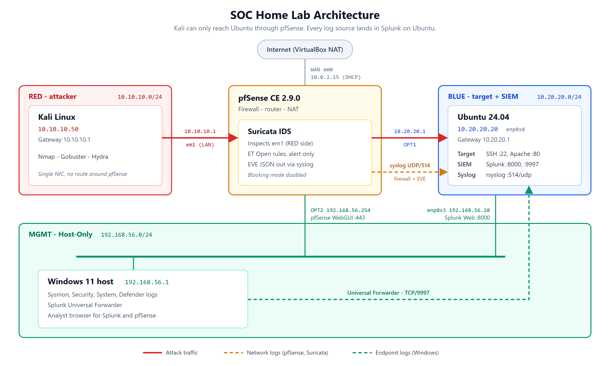

Kali is alone on the RED network and its only gateway is pfSense. To reach Ubuntu on BLUE, every packet has to enter pfSense on `em1`, the interface Suricata watches. The Windows host is not on the attack path; it forwards its own endpoint logs straight to Splunk over the Host-Only management network.

Each VM uses a **static IP on a VirtualBox Internal Network** rather than bridged networking. Internal networks keep RED and BLUE isolated from the home LAN and force all attacker-to-target traffic through pfSense, which is the whole point of the segmentation.

The two screenshots below show the result: the **pfSense dashboard** with all four interfaces and their addresses (WAN, LAN/RED, OPT1/BLUE, OPT2/MGMT), and **Ubuntu's `ip -br a` / `ip route`** confirming the BLUE and MGMT addresses with the default route pointing at pfSense (`10.20.20.1`).

<p align="center">
  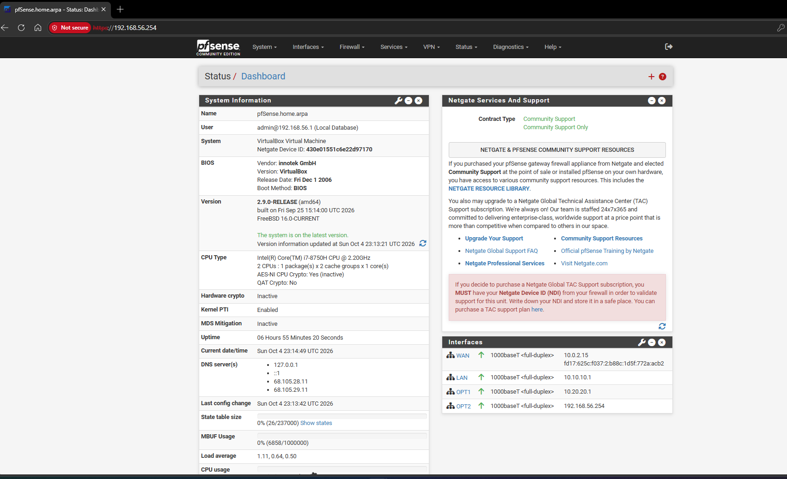
  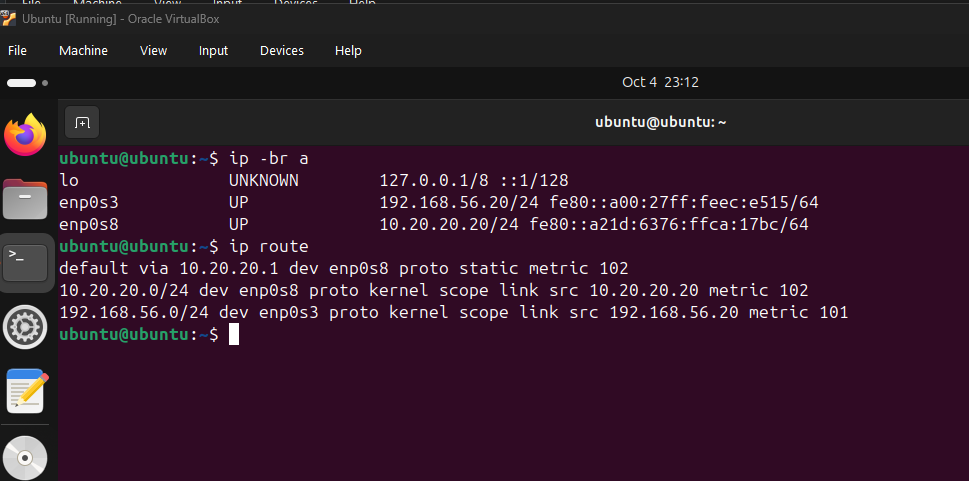
</p>

## Technology stack

- **SIEM:** Splunk Enterprise
- **Firewall / router:** pfSense Community Edition
- **IDS:** Suricata
- **Attacker:** Kali Linux (Nmap, Gobuster, Hydra)
- **Target / server:** Ubuntu (OpenSSH, Apache)
- **Endpoint telemetry:** Windows 11 (Sysmon, Microsoft Defender, Windows Event Logs)
- **Log forwarding:** Splunk Universal Forwarder, rsyslog
- **Virtualization:** Oracle VirtualBox (NAT, Internal, and Host-Only networks)

> Full build steps are in **[SETUP.md](SETUP.md)**.

## What I built

### 1. Segmented the lab

I replaced the original simpler network design with dedicated RED and BLUE networks, so Kali-to-Ubuntu traffic has to go through pfSense instead of bypassing the firewall and IDS.

- RED: `10.10.10.0/24`
- BLUE: `10.20.20.0/24`
- Management: `192.168.56.0/24`
- pfSense provides routing, firewalling, and the Internet-facing WAN/NAT path.

BLUE is allowed outbound so Ubuntu can get updates, and MGMT can only reach the pfSense WebGUI (HTTPS) and ping it.

<p align="center">
  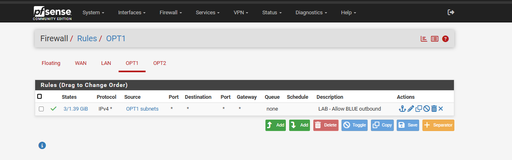
  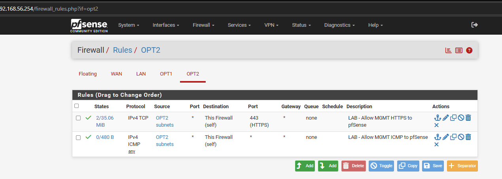
</p>

### 2. Centralized telemetry in Splunk

Splunk ingested four telemetry domains: Windows, Linux, Suricata, and pfSense. The final all-time inventory search returned **203,175 indexed events** across the four lab indexes.

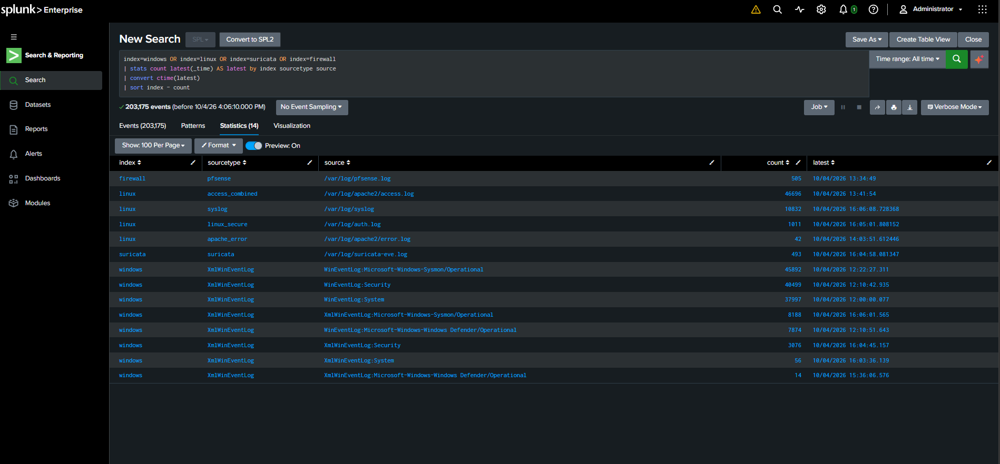

Windows forwarding was validated with both `Sysmon` and `SplunkForwarder` running, and an active forward to `192.168.56.20:9997`.

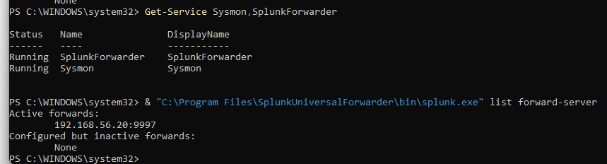

A 24-hour Windows source summary contained **35,624 events** from Sysmon, Security, System, and Defender.

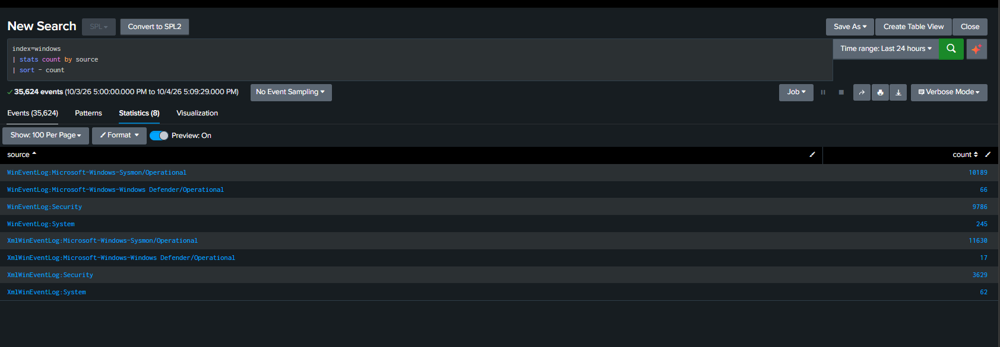

Linux telemetry included Apache access and error logs, `syslog`, and `auth.log`.

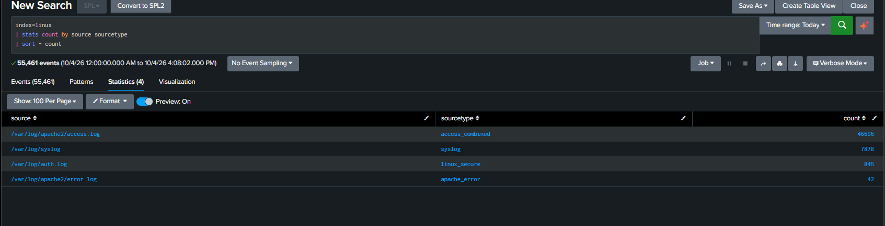

### 3. Added pfSense + Suricata monitoring

Suricata was installed on pfSense and attached to `em1` (LAN), the interface where Kali's traffic enters the firewall. It runs in IDS mode, which alerts without blocking. EVE JSON is sent over syslog to Ubuntu, where rsyslog writes it out as clean JSON for Splunk's `suricata` sourcetype.

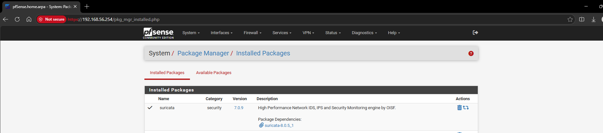

pfSense firewall logs are forwarded to the `firewall` index (505 events, sourcetype `pfsense`).

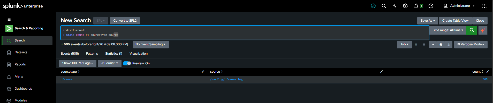

Searching that index for Kali returned 36 events. They are `filterlog` **block** entries on `em1`: pfSense's default deny rule dropping TCP packets from `10.10.10.50` that didn't belong to any open connection. Most of the visible entries are from 12:47–12:50, while the Nmap `-A` scan was running. Allowed traffic isn't logged, because pfSense only logs pass rules that have logging switched on.

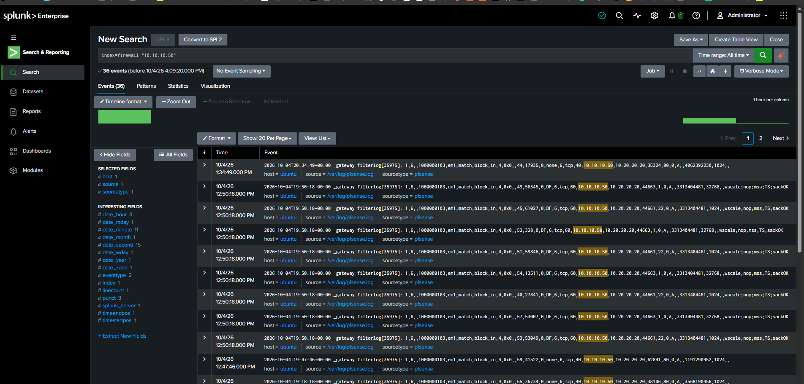

## Attack simulations and evidence

### Nmap: network and service discovery

```bash
sudo nmap -sS -sV -sC -p- -A 10.20.20.20
```

Kali scanned all 65,535 TCP ports on Ubuntu. Ten responded, including SSH (22), Apache HTTP (80), and HTTPS (443).

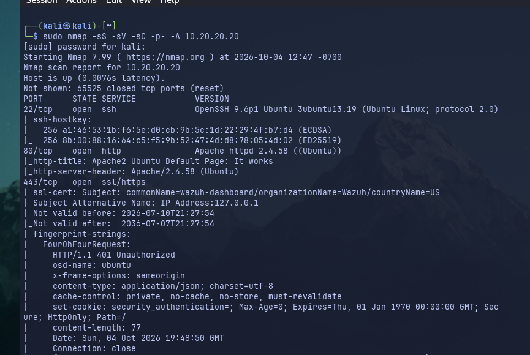

Suricata matched the ET Open signature **`ET SCAN Possible Nmap User-Agent Observed`** (SID `2024364`) on Nmap's scripted HTTP probes.

```spl
index=suricata event_type=alert src_ip="10.10.10.50"
| stats count values(dest_port) AS dest_ports by alert.signature_id alert.signature
```

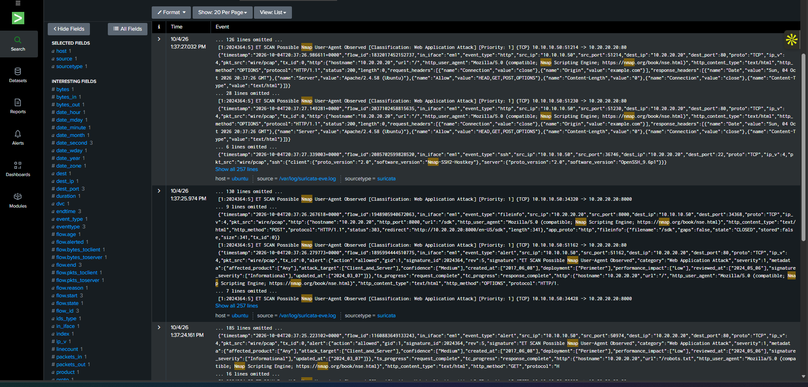

**MITRE ATT&CK:** `T1046 - Network Service Discovery`

### Gobuster: web path enumeration

```bash
gobuster dir -u http://10.20.20.20 -w /usr/share/wordlists/dirb/common.txt -x php,html,txt,bak -t 20
```

Gobuster requested about 23,000 paths from Apache on `10.20.20.20`.

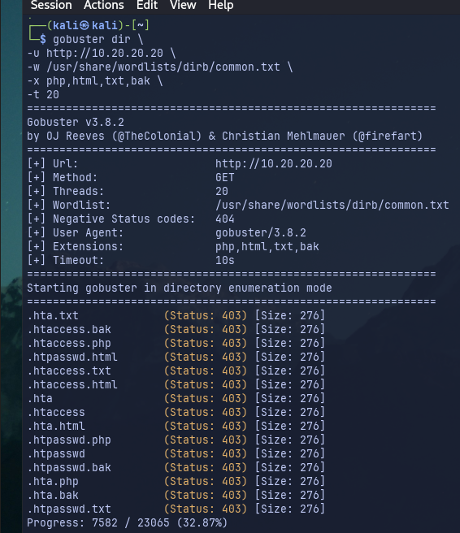

Suricata's HTTP events recorded the `gobuster/3.8.2` user agent and a stream of HTTP `404` responses.

```spl
index=suricata event_type=http src_ip="10.10.10.50"
| table _time src_ip dest_ip http.http_user_agent http.http_method http.url http.status
```

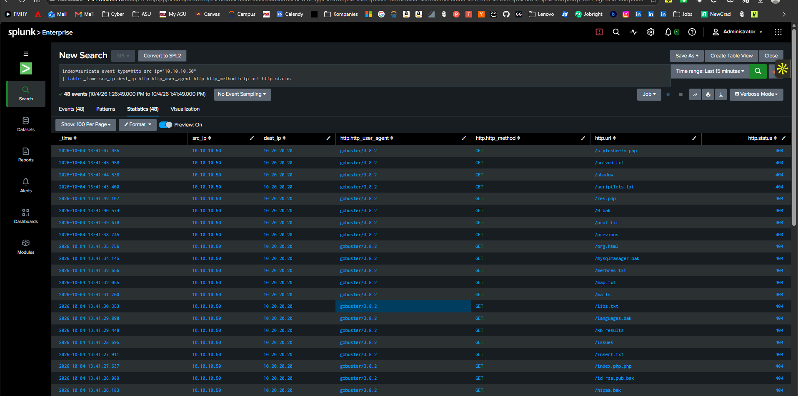

The same activity showed up independently in Apache's `access.log`: **23,097 requests** from `10.10.10.50` in 15 minutes. One source is the network sensor, the other is the server itself.

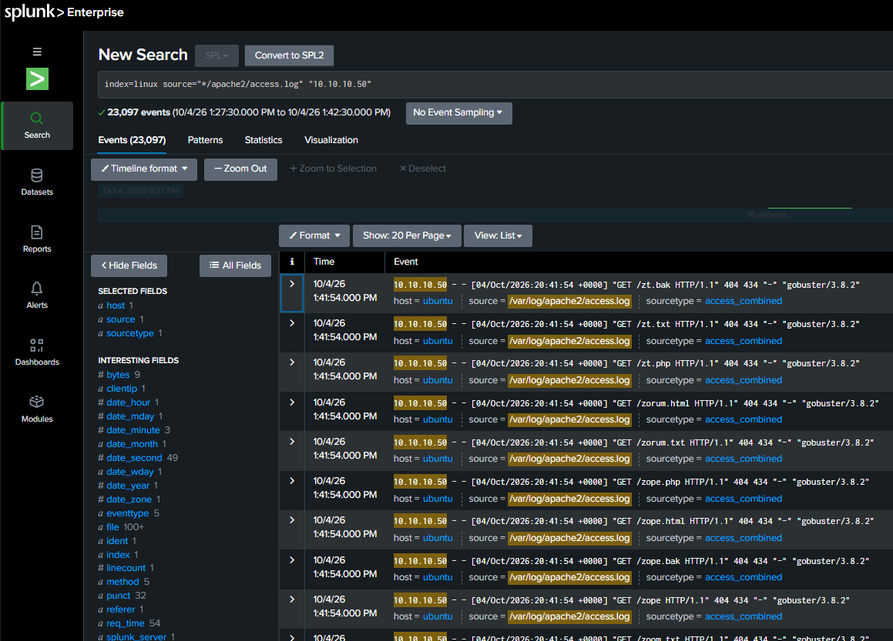

**MITRE ATT&CK:** `T1595.003 - Active Scanning: Wordlist Scanning`

### Hydra: SSH password guessing

```bash
hydra -l ubuntu -P /home/kali/Downloads/rockyou.txt ssh://10.20.20.20 -V
```

Hydra ran 16 parallel login attempts against the `ubuntu` account using the rockyou wordlist.

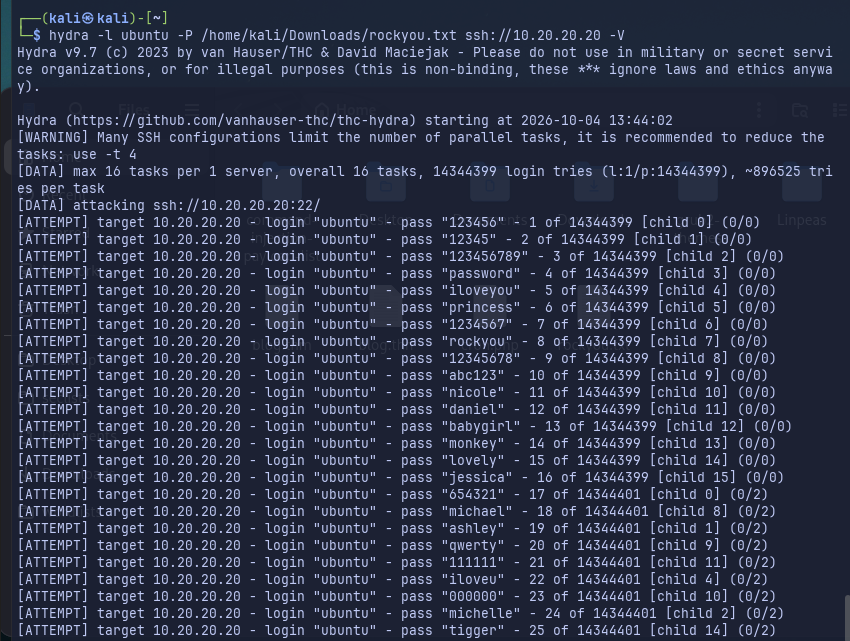

Splunk recorded **127 failed SSH password events** from `10.10.10.50` in the test window.

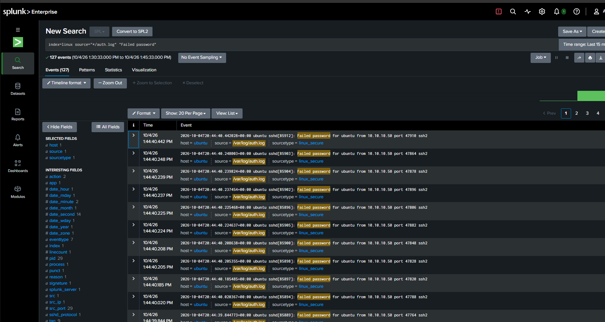

On the network side, Suricata's protocol rules fired on the same SSH sessions (`SURICATA SSH invalid banner`, SID `2228000`), on source ports matching the `auth.log` failures. The failed-login evidence itself comes from `auth.log`.

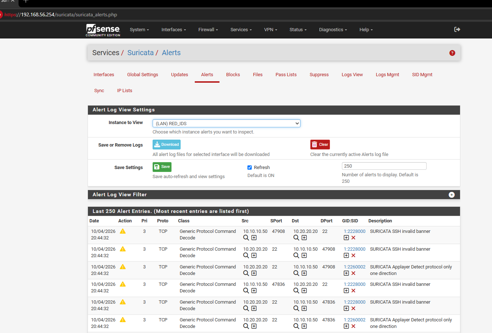

**MITRE ATT&CK:** `T1110.001 - Password Guessing`

## MITRE ATT&CK mapping

| Observed behavior | Evidence | ATT&CK mapping |
|---|---|---|
| Nmap service enumeration | Kali output + Suricata ET alert | **T1046 - Network Service Discovery** |
| Gobuster path enumeration | Suricata HTTP + Apache access logs | **T1595.003 - Wordlist Scanning** |
| SSH password guessing | Linux authentication failures + Suricata SSH alerts | **T1110.001 - Password Guessing** |

## Challenges and lessons learned

1. **Traffic initially bypassed the security path.** A simpler/direct network design did not guarantee that attacker traffic went through the firewall and IDS. I redesigned the lab around RED/BLUE internal networks with pfSense routing between them.
2. **Ubuntu NIC/profile persistence caused outages.** After a reboot, NetworkManager attached the static profiles to the wrong VirtualBox interfaces, which temporarily removed the BLUE address and default route. I bound each profile to its interface and verified with `ip -br a` and `ip route`.
3. **Splunk initially lacked permissions to read Linux logs.** The Splunk service account could not read `auth.log`, `syslog`, or the Apache logs until I fixed its group membership (`adm`).
4. **Suricata JSON reached Splunk but did not parse.** EVE JSON was wrapped in a syslog header, and the sourcetype didn't match what the add-on expects. I changed rsyslog to write only the JSON payload and set `sourcetype=suricata`, after which fields such as `event_type`, `src_ip`, `dest_ip`, HTTP data, and alert metadata became searchable.
5. **Prebuilt dashboards were not the same as validated telemetry.** I treated raw searches and correlated evidence as the source of truth when prebuilt CIM-dependent panels didn't populate right away.

## Key takeaways

- **Segmentation is what makes the data trustworthy.** IDS alerts only mean something if traffic can't go around the sensor.
- **Prove each layer before moving to the next.** Routing, then packet visibility, then sensor, then log transport, then parsing. Most debugging time went to layers that were already fine.
- **Permissions cause silent failures.** The Splunk Linux inputs and the Windows Sysmon input both failed on service-account access, with no obvious error in the UI.
- **Document as you go.** Reconstructing settings and commands afterwards is much slower than noting them while building.

## Results

A three-zone RED/BLUE/management lab that centralized **203,175 events** from Windows, Linux, pfSense, and Suricata in Splunk; detected a genuine ET Open Nmap alert, correlated Gobuster across IDS and Apache logs, and caught **127 failed SSH logins**, all mapped to **three MITRE ATT&CK techniques**.

## Future improvements

- Add saved Splunk detection rules / alerts for the three techniques (scheduled searches with thresholds).
- Switch Suricata to **IPS / blocking mode** to actively drop attacks instead of only alerting.
- Build a custom Splunk SOC dashboard for the lab indexes.
- Add an **AI-assisted triage** workflow that turns a Splunk alert into a structured incident summary.
- Ship Suricata EVE over TCP syslog (or a forwarder) so network telemetry is complete.

## Repository layout

```text
.
├── README.md
├── SETUP.md
├── architecture/
│   └── soc-lab-architecture.png
└── screenshots/          # 01-19
```
